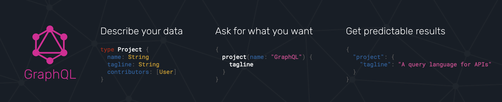
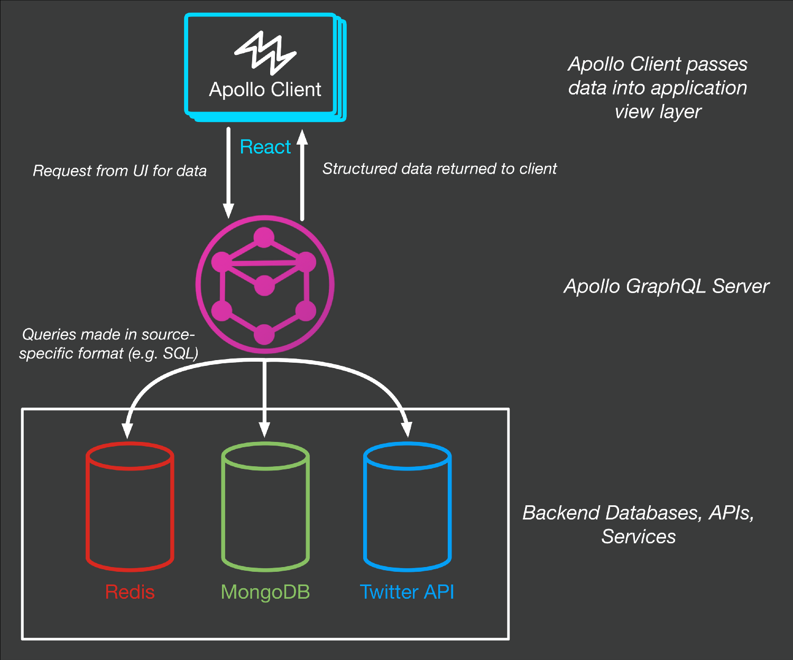
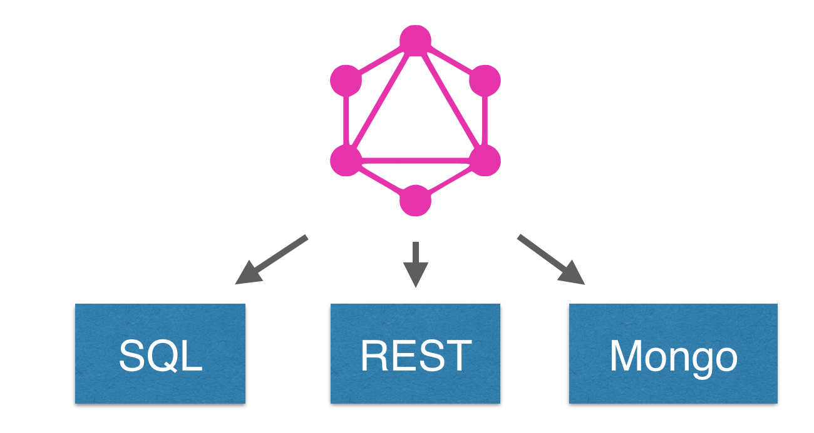
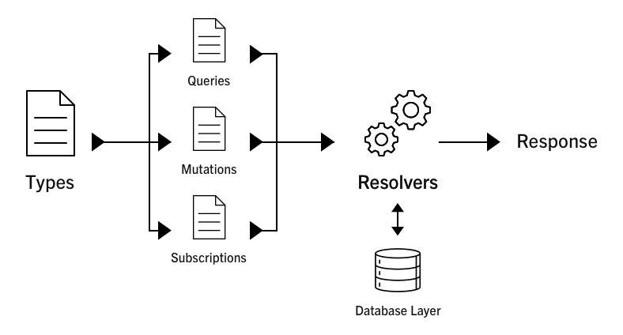

# GraphQL Workshop


## Hva er GraphQL




## GraphQL konseptuell modell



## GraphQL endepunkt, med Node Express


```javascript
import {schema} from './schema';

// GraphQL server
app.use(
  '/graphql', 
  bodyParser.json(), 
  graphqlExpress({ schema })
);

// GraphQL IDE
app.use(
  '/graphiql', 
  graphiqlExpress({ endpointURL: '/graphql' })
);
```

## GraphQL Schema


```javascript
import {makeExecutableSchema} from 'graphql-tools';

// Some fake data
const books = [
  {
    title: 'Harry Potter and the Sorcerer\'s stone',
    author: 'J.K. Rowling',
  },
  {
    title: 'Jurassic Park',
    author: 'Michael Crichton',
  },
];

// The GraphQL schema in string form
const typeDefs = `
  type Query { 
    books: [Book] 
  }
  type Book { 
    title: String, 
    author: String 
  }
`;

// The resolvers
const resolvers = {
  Query: {
    books: () => books
  },
};

// Put together a schema
export const schema = makeExecutableSchema({
  typeDefs,
  resolvers,
});
```


## Nyttige lenker
* [graphql.org](http://graphql.org/)
* [Apollo GraphQL](https://www.apollographql.com/)
* [Build a GraphQL server with Node.js](https://www.apollographql.com/docs/apollo-server/)
* [Build a GraphQL server with Node.js - GIT](https://github.com/apollographql/apollo-server-tutorial)
* [How to build a GraphQL server](https://dev-blog.apollodata.com/tutorial-building-a-graphql-server-cddaa023c035)
* [How to build a GraphQL server - GIT](https://github.com/apollographql/apollo-tutorial-kit)
* [GraphQL explained](https://dev-blog.apollodata.com/graphql-explained-5844742f195e)
* [The Fullstack Tutorial for GraphQL](https://www.howtographql.com/)
* [Creating a structured, hot-reloadable GraphQL API with Express.js, Apollo Server and Webpack](https://hackernoon.com/creating-a-structured-hot-reloadable-graphql-api-with-express-js-de62c859643)
* [apollo-tutorial-kit](https://dev-blog.apollodata.com/tutorial-building-a-graphql-server-cddaa023c035)
* [GraphQL + Apollo – Part 1: An Introduction](https://spin.atomicobject.com/2017/03/29/graphql-apollo-introduction/)
* [GraphQL + Apollo – Part 2: Building a Server](https://spin.atomicobject.com/2017/03/30/graphql-apollo-building-server/)
* [GraphQL + Apollo – Part 3: Building a Client](https://spin.atomicobject.com/2017/03/31/graphql-apollo-building-client/)
* [Implementing GraphQL Using Apollo On an Express Server](https://scotch.io/tutorials/implementing-graphql-using-apollo-on-an-express-server)
* [Implementing GraphQL in React using Apollo](https://scotch.io/tutorials/implementing-graphql-in-react-using-apollo)
* [Full-stack React + GraphQL Tutorial](https://dev-blog.apollodata.com/full-stack-react-graphql-tutorial-582ac8d24e3b)
* [GraphQL Tutorial - Getting Started](https://www.jobstart.com/posts/graphql-tutorial-getting-started)
* [FULL-STACK GRAPHQL WITH APOLLO, METEOR & REACT](https://www.leveluptutorials.com/tutorials/full-stack-graphql-with-apollo-meteor-and-react/series-introduction)
* [Apollo Server – Introduction](https://codingthesmartway.com/apollo-server-introduction/)
* [Apollo blog](https://dev-blog.apollodata.com/)
* [GraphQL After Tutorials: The blog post I wish I had when I started](https://adamtuttle.codes/graphql-after-tutorials/)
* [Apollo Client](https://www.apollographql.com/docs/react/index.html)
* [Making requests in vanilla js with Apollo](https://mikewilliamson.wordpress.com/2016/12/05/making-requests-in-vanilla-js-with-apollo/)
